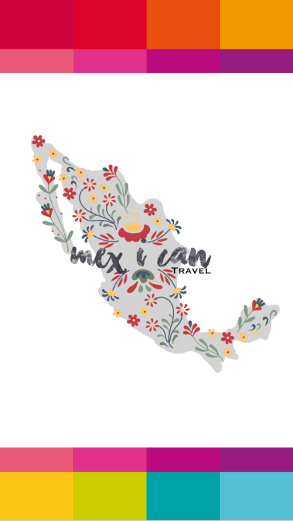
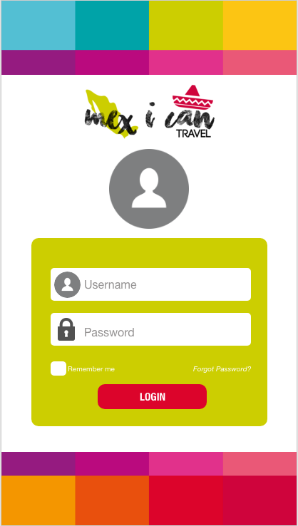
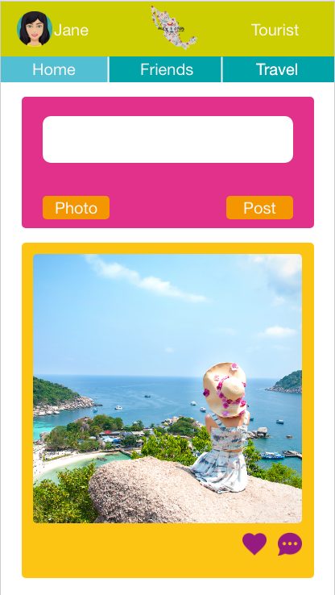
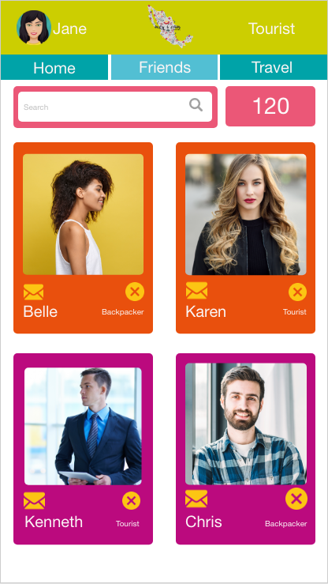
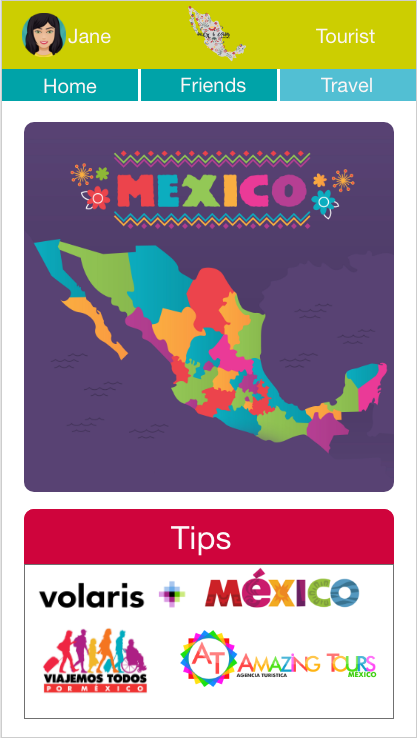

# SOCIAL NETWORK - MEX I CAN 

# MOBILE ONLY
* **Students:** Dulce Lemus & Ada Ramirez
* **Module:** 6 Make Your Own Social Network


ABOUT THE FINAL PROJECT

Instagram, Snapchat, Twitter, Facebook, Twitch, Linkedin, the social networks have invaded our lives. We love them, we hate them, we idolize  them and many of us can not live without them. Given this context, a very visionary entrepreneur has commissioned us to create a social network. He does not give us much detail about what kind of social network he wants, he only tells us that we have to create the best we can and then we can convince him that our social network will be the most successful.

---

### DESCRIPTION 

A mexican travel agency is requesting a social network where people who like to travel can join. Mex I can Travel is a mobile social network where people can meet new friends with the same interests, they can also have cool tips to help them when they travel. There are  two categories:
* **The Backpacker**, the user who likes to travel as much as likes to save money. They like to go to the markets and eat the traditional food of the different mexican states without spending a lot of money. Their ideal hotel is not a five stars hotel, but a clean and cheap one. 
* **The Tourist**, the user who doesn't mind to spend a little bit more as much as he/she is comfortable. They don't like to have surprises when they travel, they like to plan all the activities and all the meals during their trip. 

---

### OBJECTIVE:

How many times have we heard  "*I don't travel because I don't have money*"? or "*I dont't travel because I am a woman and it's dangerous*"? There are many excuses to list them all, but this mobile social network is going to eliminate them. Mex I can Travel is directed specially for mexicans, sometimes we don't appreciate what we have because we don't know what we have. That's why **Mex I Can Travel** is going to try to answer the question: **How much you know Mexico?**. We want to increase the tourism in Mexico by mexicans. This doesn't mean that other nationalities can't join. 

### PREREQUISITES:
1. Profile users.
2. A newsfeed where users can see their contacts updates.
3. A place where they can post.
4. A place where they can upload their pictures.
5. The user needs to be able to add friends in the social network.
6. Mobile friendly.
7. **Optional** If a login is created or the information is saved in a data base, Firebase is required. 

### SKETCH OF THE APP FLOW

* [Prototype with animation](https://xd.adobe.com/view/a209cdec-58f7-4f96-584e-a95dbd954be1-d438/?fullscreen)


* **COLOR PALETTE** Used to design the prototype










* **LOGO DESIGNS** 


### How does the tourism impact the economy?
````
According to OECD, Tourism is a national priority in Mexico as it generates direct and indirect jobs, 
as well as foreign currency receipts and economic growth. Tourism also promotes regional
development and productive chains, in addition to improving quality of life for families
and communities. It contributes 8.4% of Mexico’s GDP, is the fourth largest source of export
revenues, and creates around 2.5 million direct and 5 million indirect jobs.
Domestic tourism represents more than 80% of tourism in the country, mostly
generated in regions/municipalities that do not receive important international flows.

Mexico has a diversity of tourism products, offering more than 40 000 archaeological
sites (almost 200 of which are open to the public); 62 ethnic groups; 38World Heritage Sites;
83 Pueblos Mágicos (Magical Towns); 10 Rutas de México (recognised tourist routes); 14 AAA
– 5 diamond hotels and 637 000 hotel rooms; 50 world-class golf courses; the world’s
leading port in cruise ship arrivals (Cozumel); and world-class facilities for meetings and
conventions. Mexico’s gastronomy and mariachi were named Intangible Cultural Heritage
of Humanity by UNESCO.

````


